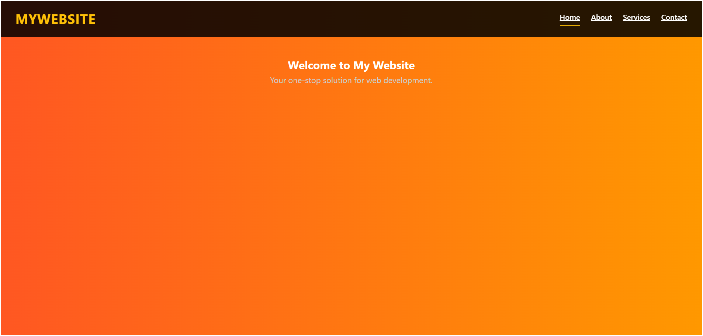
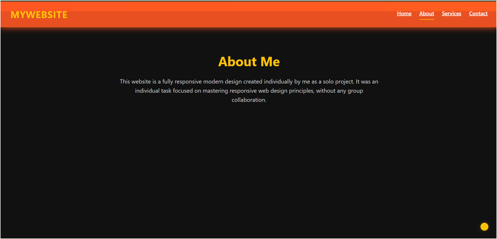

# 🌐 Responsive Landing Page

This project is a modern, responsive landing page built using **HTML**, **CSS**, and **JavaScript**. It adapts beautifully across all screen sizes—desktop, tablet, and mobile. The page includes smooth animations, interactive elements, and a clean layout suitable for personal portfolios, startups, or product showcases.

## ✨ Features

- 🔥 Fully responsive design
- 🧭 Sticky navigation bar with scroll effect
- 🎯 Smooth scroll and section highlights
- 🔧 Clean, maintainable code structure

## 🛠️ Tech Stack

- **HTML5** for structure  
- **CSS3** with media queries and transitions  
- **Vanilla JavaScript** for interactivity  

## 📸 Screenshots

